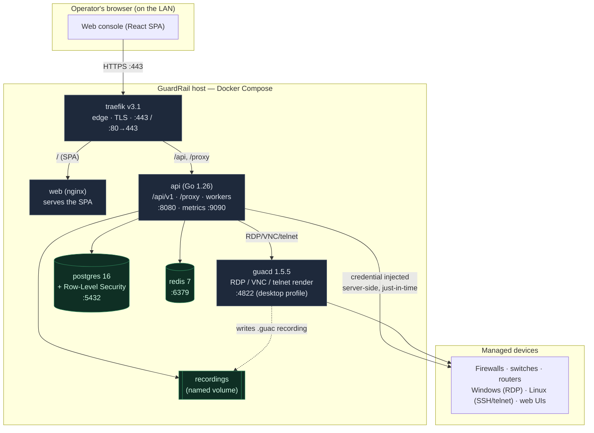

# GuardRail — Setup Guide

> Repository: **https://github.com/ansh-gadhia/guardrail**

This guide takes a fresh machine to a running GuardRail stack. For the design and
the day-to-day operator workflow, see [`docs/ARCHITECTURE.md`](docs/ARCHITECTURE.md)
and [`docs/USAGE.md`](docs/USAGE.md); for production hardening (TLS, secrets,
scaling, upgrades) see [`docs/DEPLOYMENT.md`](docs/DEPLOYMENT.md).

---

## What GuardRail is

A Privileged Access Management (PAM) platform. Operators click **Connect** and
reach a device through an isolated, recorded, fully-audited session **without ever
seeing the credential** — GuardRail injects it server-side, just-in-time. It
brokers, per device:

| Kind | Protocols | How it is served |
|------|-----------|------------------|
| Web UIs | `https`, `http` | Reverse proxy, or browser isolation (Chromium on the server, pixels to the operator) |
| Terminals | `ssh`, `telnet` | Server-side gateway; SSH keeps a text transcript |
| Desktops | `rdp`, `vnc` | Apache **guacd**, rendered to a canvas in the browser |

Terminals and desktops (`ssh`, `telnet`, `rdp`, `vnc`) are brokered through the
**guacd** sidecar and are **off by default** — enable them explicitly (see
[§5](#5-optional-enable-desktop--terminal-protocols-rdp-vnc-telnet-ssh)).

---

## Architecture



**Traffic path:** everything enters on `:443` at Traefik. Traefik serves the SPA
from `web` and forwards `/api` and `/proxy` to `api`. The operator's browser never
talks to Postgres, Redis, guacd, or the target device directly — only to Traefik.
The credential is resolved from the vault and injected **by `api`**, so it never
reaches the browser.

---

## Ports (defaults)

Every published port comes from `.env`; the defaults below apply when the variable
is unset. **Only 443 and 80 are meant to be reachable from the LAN.**

| Port | Service | Exposure | `.env` variable | Purpose |
|------|---------|----------|-----------------|---------|
| **443** | traefik | **LAN** | `GUARDRAIL_HTTPS_PORT` | Console + API + brokered sessions (HTTPS) |
| **80** | traefik | **LAN** | `GUARDRAIL_HTTP_PORT` | Redirects to HTTPS |
| 5432 | postgres | loopback `127.0.0.1` | `POSTGRES_PORT` / `POSTGRES_BIND_ADDR` | Database (psql, backups) |
| 6379 | redis | loopback `127.0.0.1` | `REDIS_PORT` / `REDIS_BIND_ADDR` | Cache / sessions |
| 4822 | guacd | loopback `127.0.0.1` | `GUACD_PORT` / `GUACD_BIND_ADDR` | RDP/VNC/telnet rendering (desktop profile) |
| 8080 | api | **internal only** | `GUARDRAIL_HTTP_ADDR` | API — never published; sits behind Traefik |
| 9090 | api | **internal only** | `GUARDRAIL_METRICS_ADDR` | Prometheus metrics |
| 5173 | vite | **dev only** | — | Frontend dev server (`npm run dev`) |

> ⚠️ **Do not widen the guacd bind.** guacd has no authentication of its own —
> anything that reaches `:4822` can ask it to connect anywhere with any
> credential. Keep it on loopback.

---

## 1. Prerequisites

For the standard (Docker Compose) deploy you need only:

- **Docker Engine** + **Docker Compose v2** (`docker compose version`)
- **openssl** (for the self-signed dev certificate)

Go and Node are **not** needed for compose — both images build themselves. They
are required only for `make install-native` (see [§6](#6-native-mode-reaching-lan-only-devices)).

```bash
# Ubuntu / Debian
curl -fsSL https://get.docker.com | sh
sudo apt-get install -y openssl
sudo usermod -aG docker "$USER"   # then log out/in, or run the steps as root
```

---

## 2. Get the code

```bash
git clone https://github.com/ansh-gadhia/guardrail.git
cd guardrail
```

---

## 3. First run

```bash
make install
```

`make install` runs [`scripts/bootstrap.sh`](scripts/bootstrap.sh), which is
**idempotent** — run it again after a `git pull` to migrate and restart. It:

1. Checks prerequisites and stops with a clear message if any are missing.
2. Generates `.env` with fresh secrets (including the vault master key) — and
   **never overwrites an existing `.env`**.
3. Issues a self-signed TLS certificate for `localhost` + this host's IPs.
4. Creates the desktop-recording directory with the right ownership.
5. Starts Postgres and Redis, applies migrations, loads the seed data.
6. Builds and starts every image, then waits until the API answers `/healthz`.

> **Guard `.env` with your life.** It holds `GUARDRAIL_MASTER_KEY`, the key every
> vaulted credential is sealed under. Replace it and every stored credential is
> unrecoverable — with no error at boot. Back it up off the box; never copy one
> server's `.env` to another.

---

## 4. First sign-in

The first super admin is created on first boot from `GUARDRAIL_ADMIN_EMAIL` and
`GUARDRAIL_ADMIN_PASSWORD` in `.env`:

```bash
grep GUARDRAIL_ADMIN .env
```

Browse to **`https://<server-lan-ip>/`**, accept the self-signed certificate
warning (replace the cert before real use — [Deployment §5.1](docs/DEPLOYMENT.md)),
sign in, and change the password from **Account → Password**.

To bootstrap an admin manually instead, leave both blank and run:

```bash
docker compose exec api /guardrail seed-admin --email you@yourco.com --password '...'
```

---

## 5. (Optional) Enable desktop & terminal protocols (RDP, VNC, telnet, SSH)

These run through the **guacd** sidecar, which lives behind the `desktop` Compose
profile and is **not started by `make install`**. To enable them:

```bash
# 1. Turn the gateways on in the API
sed -i 's/^GUARDRAIL_DESKTOP_ENABLED=false/GUARDRAIL_DESKTOP_ENABLED=true/' .env

# 2. Rebuild the API with the new setting AND start guacd (the profile)
docker compose --profile desktop up -d --build
```

Notes that will save you time:

- **Recording ownership.** guacd (uid 1000) writes recordings; the API reads them
  back through a shared group. `make install` sets the recording directory to
  `1000:1000` mode `2770`, and the API joins guacd's group. If desktop sessions
  connect but record nothing, fix it with:
  ```bash
  sudo chown 1000:1000 /var/lib/guardrail/desktop-recordings
  sudo chmod 2770 /var/lib/guardrail/desktop-recordings
  ```
- **Windows RDP username.** Enter it as `.\Administrator` for a local account or
  `DOMAIN\user` for a domain account. A bare username makes Windows NLA try the
  wrong domain and drop to the interactive login ("logs in as the wrong user").
- **Break-glass RDP** (connecting with no bound credential to reach the device's
  own login) requires the Windows target to permit a non-NLA login — i.e. "Require
  NLA" turned **off** on that host. With NLA required, there is no login screen to
  reach without a credential.

---

## 6. Native mode (reaching LAN-only devices)

If your devices sit on a network the container bridge cannot reach — common for
firewall/switch management UIs — run the API as a **host process** instead:

```bash
make deps            # installs host Chromium etc. (native only)
make install-native
```

Only `install-native` needs host Chromium and Node; the compose API image ships
its own. In native mode the console is served from `frontend/dist` and the API
binds `:8080` on the host.

---

## 7. Verify

```bash
curl -fskS https://localhost/api/v1/version   # {"name":"GuardRail","version":"..."}
curl -fskS https://localhost/healthz          # ok
docker compose ps                             # every service Up / healthy
```

`-k` skips verification of the self-signed certificate.

Then follow the **[Usage guide](docs/USAGE.md)**: add a device → bind a credential
→ **Connect**.

---

## 8. Common operations

```bash
docker compose ps                       # service status
docker compose logs -f api              # follow API logs
docker compose logs api | grep -i record  # diagnose recording issues
make migrate                            # apply new DB migrations
make migrate-down                       # roll back one migration
docker compose down                     # stop (keeps data in named volumes)
docker compose down -v                  # stop AND destroy all data — irreversible
```

**Backups.** Session recordings are audit evidence. Back up the `pgdata` and
`recordings` volumes **together** — a recording row in Postgres that points at
bytes you no longer have looks like tampering.

---

## 9. Troubleshooting

| Symptom | Cause & fix |
|---------|-------------|
| `make deps` → "No rule to make target" | Old checkout — re-sync from the repo. `deps` is native-only. |
| Console build fails on a compose deploy | You don't need to build it on the host; the `web` image does. Re-run `make install`. |
| Desktop session connects but recording is empty / "not stored" | Recording dir ownership — see [§5](#5-optional-enable-desktop--terminal-protocols-rdp-vnc-telnet-ssh). |
| RDP "logs in as the wrong user" | Use `.\User` or `DOMAIN\user` in the credential's username. |
| RDP break-glass "Server refused connection (wrong security type?)" | The target requires NLA; turn off "Require NLA" on the Windows host, or bind a credential. |
| Browser isolation / recorded web device refused at Connect | No usable Chromium. In compose it's in the image; native → `make deps`. |
| `docker compose` says a password variable is missing | You're running compose commands without `.env`. Run `make install` first, or export the vars. |

For deeper design and security context see [`docs/ARCHITECTURE.md`](docs/ARCHITECTURE.md)
and [`docs/SECURITY.md`](docs/SECURITY.md).

---

## Upgrading

```bash
git pull            # or re-sync your working copy
make install        # idempotent: migrates the schema, rebuilds, restarts
# If you use desktop protocols, also:
docker compose --profile desktop up -d --build
```

`make install` never touches an existing `.env`, and migrations are backward
compatible with the running binary (they apply before the restart). Data lives in
the named volumes and survives everything except `docker compose down -v`.
