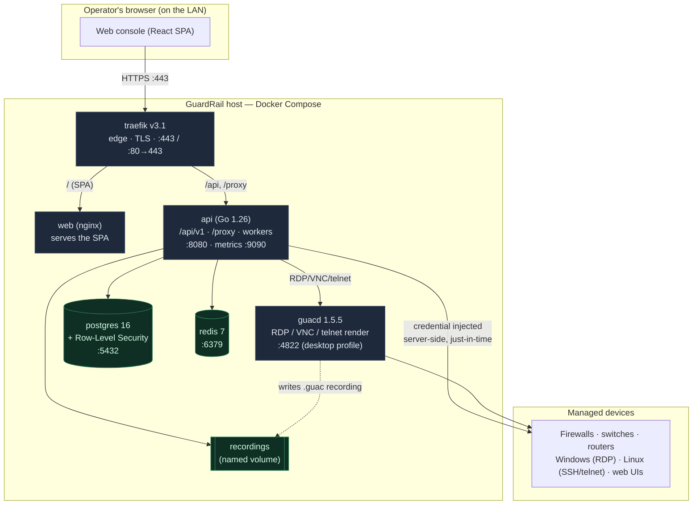

# GuardRail — Setup Guide

> Repository: **https://github.com/ansh-gadhia/guardrail**

This guide takes a fresh machine to a running GuardRail stack. For the design and
the day-to-day operator workflow, see [`docs/ARCHITECTURE.md`](docs/ARCHITECTURE.md)
and [`docs/USAGE.md`](docs/USAGE.md); for production hardening (TLS, secrets,
scaling, upgrades) see [`docs/DEPLOYMENT.md`](docs/DEPLOYMENT.md).

---

## What GuardRail is

A Privileged Access Management (PAM) platform. Operators click **Connect** and
reach a device through an isolated, recorded, fully-audited session **without ever
seeing the credential** — GuardRail injects it server-side, just-in-time. It
brokers, per device:

| Kind | Protocols | How it is served |
|------|-----------|------------------|
| Web UIs | `https`, `http` | Reverse proxy, or browser isolation (Chromium on the server, pixels to the operator) |
| Terminals | `ssh`, `telnet` | Server-side gateway; SSH keeps a text transcript |
| Desktops | `rdp`, `vnc` | Apache **guacd**, rendered to a canvas in the browser |

Terminals and desktops (`ssh`, `telnet`, `rdp`, `vnc`) are brokered through the
**guacd** sidecar and are **off by default** — enable them explicitly (see
[§5](#5-optional-enable-desktop--terminal-protocols-rdp-vnc-telnet-ssh)).

---

## Architecture


```mermaid
flowchart TB
    subgraph client["Operator's browser (on the LAN)"]
        UI["Web console (React SPA)"]
    end

    subgraph host["GuardRail host — Docker Compose"]
        traefik["traefik v3.1<br/>edge · TLS · :443 / :80→443"]
        web["web (nginx)<br/>serves the SPA"]
        api["api (Go 1.26)<br/>/api/v1 · /proxy · workers<br/>:8080 · metrics :9090"]
        guacd["guacd 1.5.5<br/>RDP / VNC / telnet render<br/>:4822 (desktop profile)"]
        pg[("postgres 16<br/>+ Row-Level Security<br/>:5432")]
        redis[("redis 7<br/>:6379")]
        rec[["recordings<br/>(named volume)"]]
    end

    subgraph targets["Managed devices"]
        dev["Firewalls · switches · routers<br/>Windows (RDP) · Linux (SSH/telnet) · web UIs"]
    end

    UI -->|"HTTPS :443"| traefik
    traefik -->|"/ (SPA)"| web
    traefik -->|"/api, /proxy"| api
    api --> pg
    api --> redis
    api -->|"RDP/VNC/telnet"| guacd
    api -->|"credential injected<br/>server-side, just-in-time"| dev
    guacd --> dev
    api --> rec
    guacd -.->|"writes .guac recording"| rec

    classDef edge fill:#1e293b,stroke:#475569,color:#e2e8f0;
    classDef data fill:#0f2f24,stroke:#2f855a,color:#d1fae5;
    class traefik,web,api,guacd edge;
    class pg,redis,rec data;
```

**Traffic path:** everything enters on `:443` at Traefik. Traefik serves the SPA
from `web` and forwards `/api` and `/proxy` to `api`. The operator's browser never
talks to Postgres, Redis, guacd, or the target device directly — only to Traefik.
The credential is resolved from the vault and injected **by `api`**, so it never
reaches the browser.

---

## Ports (defaults)

Every published port comes from `.env`; the defaults below apply when the variable
is unset. **Only 443 and 80 are meant to be reachable from the LAN.**

| Port | Service | Exposure | `.env` variable | Purpose |
|------|---------|----------|-----------------|---------|
| **443** | traefik | **LAN** | `GUARDRAIL_HTTPS_PORT` | Console + API + brokered sessions (HTTPS) |
| **80** | traefik | **LAN** | `GUARDRAIL_HTTP_PORT` | Redirects to HTTPS |
| 5432 | postgres | loopback `127.0.0.1` | `POSTGRES_PORT` / `POSTGRES_BIND_ADDR` | Database (psql, backups) |
| 6379 | redis | loopback `127.0.0.1` | `REDIS_PORT` / `REDIS_BIND_ADDR` | Cache / sessions |
| 4822 | guacd | loopback `127.0.0.1` | `GUACD_PORT` / `GUACD_BIND_ADDR` | RDP/VNC/telnet rendering (desktop profile) |
| 8080 | api | **internal only** | `GUARDRAIL_HTTP_ADDR` | API — never published; sits behind Traefik |
| 9090 | api | **internal only** | `GUARDRAIL_METRICS_ADDR` | Prometheus metrics |
| 5173 | vite | **dev only** | — | Frontend dev server (`npm run dev`) |

> ⚠️ **Do not widen the guacd bind.** guacd has no authentication of its own —
> anything that reaches `:4822` can ask it to connect anywhere with any
> credential. Keep it on loopback.

---

## 0. Quick install (recommended for servers)

One script, no checkout, no build. It installs Docker if missing, asks for the
few settings that cannot be guessed, pulls the published images from GHCR and
starts everything under `/opt/guardrail`:

```bash
curl -fsSL https://raw.githubusercontent.com/ansh-gadhia/guardrail/main/scripts/install.sh -o install.sh
sudo bash install.sh
```

It asks for: HTTPS port, HTTP port, admin email and password, whether to run the
bundled DNS resolver for the session tunnel, and whether to enable desktop
(RDP/VNC) access. Everything else — the JWT signing key, the vault master key
and both database passwords — is generated.

The installer copies itself to `/opt/guardrail/install.sh`, so every later
update is one command on the server with no checkout and nothing to fetch by
hand:

```bash
sudo /opt/guardrail/install.sh      # then pick Update
```

It refreshes itself from the repository before it does anything else, so it is
always the current installer that runs — which matters, because the installer is
what knows which `.env` keys a release introduces and which superseded values it
corrects. Set `GUARDRAIL_NO_SELF_UPDATE=1` to pin it to the copy on disk.

Run it again at any time to reach the same menu:

| Option | What it does |
|---|---|
| **Install** | Fresh setup. Refuses to clobber an existing config without confirmation. |
| **Update** | Pulls a newer version and **re-asks the DNS question**. Secrets, admin credentials and data are left alone. |
| **Stop** | Stops the stack; all data kept. |
| **Remove** | Deletes containers, images, volumes, `/opt/guardrail` and `/var/lib/guardrail`. Irreversible, and asks you to type `REMOVE`. |

The stack restarts by itself after a server reboot: every service is
`restart: unless-stopped` and the installer enables the Docker service at boot.

> **Back up `/opt/guardrail/.env`.** `GUARDRAIL_MASTER_KEY` is the only thing that
> can decrypt the credential vault. Lose that file and every stored device
> credential is unrecoverable — restoring the database alone will not do it.

The rest of this guide covers building from a checkout, which is what you want
for development or an air-gapped install.

---

## 1. Prerequisites

For the standard (Docker Compose) deploy you need only:

- **Docker Engine** + **Docker Compose v2** (`docker compose version`)
- **openssl** (for the self-signed dev certificate)

Go and Node are **not** needed for compose — both images build themselves. They
are required only for `make install-native` (see [§6](#6-native-mode-reaching-lan-only-devices)).

```bash
# Ubuntu / Debian
curl -fsSL https://get.docker.com | sh
sudo apt-get install -y openssl
sudo usermod -aG docker "$USER"   # then log out/in, or run the steps as root
```

---

## 2. Get the code

```bash
git clone https://github.com/ansh-gadhia/guardrail.git
cd guardrail
```

---

## 3. First run

```bash
make install
```

`make install` runs [`scripts/bootstrap.sh`](scripts/bootstrap.sh), which is
**idempotent** — run it again after a `git pull` to migrate and restart. It:

1. Checks prerequisites and stops with a clear message if any are missing.
2. Generates `.env` with fresh secrets (including the vault master key) — and
   **never overwrites an existing `.env`**.
3. Issues a self-signed TLS certificate for `localhost` + this host's IPs.
4. Creates the desktop-recording directory with the right ownership.
5. Starts Postgres and Redis, applies migrations, loads the seed data.
6. Builds and starts every image, then waits until the API answers `/healthz`.

> **Guard `.env` with your life.** It holds `GUARDRAIL_MASTER_KEY`, the key every
> vaulted credential is sealed under. Replace it and every stored credential is
> unrecoverable — with no error at boot. Back it up off the box; never copy one
> server's `.env` to another.

---

## 4. First sign-in

The first super admin is created on first boot from `GUARDRAIL_ADMIN_EMAIL` and
`GUARDRAIL_ADMIN_PASSWORD` in `.env`:

```bash
grep GUARDRAIL_ADMIN .env
```

Browse to **`https://<server-lan-ip>/`**, accept the self-signed certificate
warning (replace the cert before real use — [Deployment §5.1](docs/DEPLOYMENT.md)),
sign in, and change the password from **Account → Password**.

To bootstrap an admin manually instead, leave both blank and run:

```bash
docker compose exec api /guardrail seed-admin --email you@yourco.com --password '...'
```

---

## 5. (Optional) Enable desktop & terminal protocols (RDP, VNC, telnet, SSH)

These run through the **guacd** sidecar, which lives behind the `desktop` Compose
profile and is **not started by `make install`**. To enable them:

```bash
# 1. Turn the gateways on in the API
sed -i 's/^GUARDRAIL_DESKTOP_ENABLED=false/GUARDRAIL_DESKTOP_ENABLED=true/' .env

# 2. Rebuild the API with the new setting AND start guacd (the profile)
docker compose --profile desktop up -d --build
```

Notes that will save you time:

- **Recording ownership.** guacd (uid 1000) writes recordings; the API reads them
  back through a shared group. `make install` sets the recording directory to
  `1000:1000` mode `2770`, and the API joins guacd's group. If desktop sessions
  connect but record nothing, fix it with:
  ```bash
  sudo chown 1000:1000 /var/lib/guardrail/desktop-recordings
  sudo chmod 2770 /var/lib/guardrail/desktop-recordings
  ```
- **Windows RDP username.** Enter it as `.\Administrator` for a local account or
  `DOMAIN\user` for a domain account. A bare username makes Windows NLA try the
  wrong domain and drop to the interactive login ("logs in as the wrong user").
- **Break-glass RDP** (connecting with no bound credential to reach the device's
  own login) requires the Windows target to permit a non-NLA login — i.e. "Require
  NLA" turned **off** on that host. With NLA required, there is no login screen to
  reach without a credential.

---

## 6. Native mode (reaching LAN-only devices)

If your devices sit on a network the container bridge cannot reach — common for
firewall/switch management UIs — run the API as a **host process** instead:

```bash
make deps            # installs host Chromium etc. (native only)
make install-native
```

Only `install-native` needs host Chromium and Node; the compose API image ships
its own. In native mode the console is served from `frontend/dist` and the API
binds `:8080` on the host.

---

## 6b. Session delivery: wildcard DNS for the tunnel

A proxied device opens at **`https://<session-id>.tunnel.guardrail.lan/`** — the
device's own UI at the root of its own origin.

**Why it works this way.** Served under a path prefix (`/proxy/<sid>/`), a device
UI written for `/` needs every root-absolute URL rewritten, and `window.location`
cannot be intercepted by any script — it is a non-configurable platform object.
An appliance SPA that navigates with `window.location = "/ng/..."` therefore
escapes the prefix and lands on the GuardRail console. On its own hostname there
is no prefix to escape, so appliance SPAs work unmodified.

This is the only part of GuardRail that needs something outside this server: the
**operator's browser** must resolve `*.tunnel.guardrail.lan`. Pick one.

**Option A — one record on your LAN resolver** (preferred; nothing to run here).
`make install` prints your server's IP; point a wildcard at it:

| Resolver | Record |
| --- | --- |
| dnsmasq / OpenWrt / Pi-hole | `address=/tunnel.guardrail.lan/<SERVER_IP>` |
| pfSense / OPNsense (Unbound) | `local-zone: "tunnel.guardrail.lan" redirect` + `local-data: "tunnel.guardrail.lan 3600 IN A <SERVER_IP>"` |
| Windows Server DNS | New zone `tunnel.guardrail.lan`, host (A) record `*` → `<SERVER_IP>` |
| BIND | `*   IN  A   <SERVER_IP>` |

**Option B — run the bundled resolver on this server** (no router access needed).
Use this when clients get DNS from your ISP or a public resolver rather than from
the router, so there is no router record to add:

```bash
docker compose --profile dns up -d
docker compose logs dns      # prints the address it detected and is listening on
```

Then set client machines' **primary** DNS to this server, keeping their normal
resolver as secondary.

- It detects this host's current LAN IP itself, so a DHCP lease change needs no
  edit — it re-detects on restart.
- It binds **that address specifically**, not `0.0.0.0`, so it coexists with
  `systemd-resolved` (which holds `127.0.0.53`). You do **not** need to disable
  the stub listener, and the server's own DNS is unaffected.
- Names under the tunnel domain are answered locally; everything else is
  forwarded upstream, so clients can safely use it as their only resolver.
  Upstreams default to `8.8.8.8` and `1.1.1.1` — override with
  `GUARDRAIL_DNS_UPSTREAM` / `GUARDRAIL_DNS_UPSTREAM2` in `.env` to point at your
  own resolvers (required if this network has no internet access).
- `restart: unless-stopped` means it comes back after a reboot, and a plain
  `docker compose up -d` will not stop it.

> `/etc/hosts` **cannot** do this: it has no wildcards, and a session id is new
> every time. You need a real resolver.

**Certificate.** `make install` puts `*.tunnel.guardrail.lan` in the self-signed
cert it generates, so the tunnel is trusted exactly as much as the console is (one
click-through). Re-run `make install` after changing the domain — it detects the
cert no longer names it and regenerates.

**Changing or disabling it.** Set `GUARDRAIL_TUNNEL_DOMAIN` in `.env` (use a
domain you own, or `.lan` / `.internal` — never `.local`, which collides with
mDNS), then `docker compose up -d`. Setting it **empty** turns the tunnel off, and
proxy sessions serve under `/proxy/<sid>/` as they did before. Never put an IP
here; the server's address is auto-detected and is not part of this name.

---

## 7. Verify

```bash
curl -fskS https://localhost/api/v1/version   # {"name":"GuardRail","version":"..."}
curl -fskS https://localhost/healthz          # ok
docker compose ps                             # every service Up / healthy
```

`-k` skips verification of the self-signed certificate.

Then follow the **[Usage guide](docs/USAGE.md)**: add a device → bind a credential
→ **Connect**.

### API tokens (for scripts and dashboards)

A user's access token expires after 15 minutes, and every login writes an audit
event — so polling with one buries the audit trail. Machine integrations use an
**API token** instead: no login, no expiry unless you set one, one audit event
when it is issued and one when it is revoked.

**You already have one.** The installer mints a read-only token at the end of a
fresh install and prints it once, so a monitoring box can start polling without
anyone signing in first. It is named `installer-bootstrap` and carries
`device:read`, `session:read`, `recording:read`, `group:read`, `log:read` and
`report:read` — not `user:read` / `role:read` / `org:read`, because "what is on
the network" and "who works here" are different questions and an unattended
credential should only answer the first.

**In the console:** *Account → API tokens* (super admins only) lists every token
with its prefix, scopes, and when it was last used, and has buttons to issue and
revoke. That is the easiest route; the API below is for scripting it.

#### Does a token survive a password change or turning on MFA?

Yes. Both. A token is not a session and is not tied to the account that issued
it: it is verified by hashing the presented value and looking it up, then
checking only whether it has been revoked or has expired. Changing your password
signs out your browser sessions and leaves tokens working; enrolling in MFA adds
a factor to *login*, which a token never performs. Deleting the issuing user
leaves it working too — `created_by` simply becomes null.

The consequence is worth stating plainly: **rotating your password is not a way
to cut off a leaked token.** Revoke it, in the console or with `DELETE`, which
takes effect on its next request.

Issue one as a super admin:

```bash
ADMIN=$(curl -sk https://localhost/api/v1/auth/login \
  -H 'Content-Type: application/json' \
  -d '{"email":"admin@yourco.com","password":"..."}' | jq -r .access_token)

curl -sk https://localhost/api/v1/api-tokens \
  -H "Authorization: Bearer $ADMIN" -H 'Content-Type: application/json' \
  -d '{"name":"noc-dashboard","scopes":["device:read"]}' | jq
```

```json
{
  "id": "…", "name": "noc-dashboard", "prefix": "grt_4GFFtowG",
  "scopes": ["device:read"], "revoked": false,
  "token": "grt_4GFFtowG…",
  "warning": "Copy this token now — it is not stored and cannot be shown again."
}
```

**The `token` value is shown once.** Only its SHA-256 is stored, so a database
backup is not a set of working credentials — and nothing, including a super
admin, can print it again. Lost one? Revoke it and issue another.

Then just use it, indefinitely:

```bash
curl -sk https://localhost/api/v1/status/devices -H "Authorization: Bearer $GR_TOKEN" | jq
```

| | |
|---|---|
| **Add an expiry** | `"expires_at": "2027-01-01T00:00:00Z"` (RFC3339). Omit for none. |
| **List** | `GET /api/v1/api-tokens` — metadata and `last_used_at`, never the value |
| **Revoke** | `DELETE /api/v1/api-tokens/{id}` — takes effect on the next request |

**Scopes are read-only.** `device:read`, `session:read`, `recording:read`,
`group:read`, `log:read`, `report:read`, `user:read`, `role:read`, `org:read` —
anything else is refused at creation. That is deliberate: `access_sessions.user_id`
is a foreign key to `users`, so a token cannot be the actor on a brokered session
even in principle, and a never-expiring credential sitting in a config file that
could open a session to a firewall is a much bigger decision than letting a
dashboard see what is online.

Issuing and revoking are **super-admin only**, and a token can never hold super
admin itself.

### Device status feed

For a NOC board or an external monitor, `GET /api/v1/status/devices` returns just
the device name, type, address and whether it answered its last health probe:

```bash
curl -sk https://localhost/api/v1/status/devices -H "Authorization: Bearer $GR_TOKEN" | jq
```

```json
{
  "data": [
    { "id": "…", "name": "Edge Firewall", "device_type": "firewall",
      "ip": "10.200.10.1", "port": 2443, "status": "online",
      "checked_at": "2026-08-10T06:55:02Z", "latency_ms": 12 }
  ],
  "summary": { "total": 18, "online": 16, "offline": 1, "unknown": 1 }
}
```

It needs the same bearer token and the same `device:read` permission as the
device list, and is scoped to the caller's organization — a caller sees exactly
the devices they could already list, and nothing beyond these four fields.

`status` is `online`, `offline`, or `unknown` for a device that has never been
probed. `unknown` is deliberately distinct: "we have not looked" is not the same
claim as "we looked and it is down". Freshness is bounded by
`GUARDRAIL_HEALTH_POLL_INTERVAL` (60s by default), which is why `checked_at` is
returned alongside — poll faster than that and you will read the same answer.

---

## 7b. Access policy: who connects as whom, and who says yes

Two settings live on every device, under **Devices → (a device) → Access policy**.
Both default to the behaviour GuardRail has always had, so an upgrade changes
nothing until you change something.

### Per-user accounts

By default a device holds **one shared login** and everyone entitled to the
device is injected with it. That is right for an appliance with a single admin
account and wrong wherever your operators hold named accounts on the target —
because the device's own logs then record the shared account for every session,
which destroys the attribution the audit trail exists to provide.

Switch **Credentials** to **Per-user accounts** and each person is injected with
their own login instead.

> **These are accounts that exist on the device** — `jsmith-admin` — **not
> somebody's GuardRail or Active Directory password.** GuardRail must never hold
> a person's own login, and nothing in the product asks for one.

Two ways to bind them:

| Where | When to use it |
|---|---|
| **Devices → Access policy → Manage** | One device. |
| **Access Control → Per-user accounts** | An asset group. The account then works on every device beneath it, including devices added later. |

Bind at the group. One named account usually covers a whole rack, and binding
per device is thirty rows per person — a set nobody maintains. The nearest group
wins, so an account bound on *Datacentre / Core* beats one bound on *Datacentre*,
and an account bound on the device itself beats both.

**A per-user device never falls back to the shared login.** Somebody with no
account bound is refused, and told so on the device page before they try. The
alternative would log them into the device as the shared admin account when they
were supposed to appear in its logs under their own name.

Forty people across twenty devices is not a form-fill job — paste a CSV into
**Access Control → Per-user accounts → Bulk import**:

```csv
user_email,device_id,group_id,username,secret,injection
alice@corp.com,,4f1c…,alice-admin,s3cret,ssh-password
```

Every failed row is reported with its line number; the rest still import.

**Ageing secrets** on the same page lists credentials nobody has changed in a
long time. Per-user accounts multiply the number of secrets in the vault by the
number of people, and stale ones are how that rots.

### Approvals

Turn on **Require approval** and connecting waits for a decision from somebody
who ranks above the requester.

Rank comes from roles. Each role has an **approval level** (Access Control →
Roles → *Edit* on the rank row); a person's rank is the highest of their roles'.
The seeded ladder is:

| Role | Rank |
|---|---|
| Super Admin | 100 |
| Organization Admin | 50 |
| Operator | 10 |
| Auditor, Read-only | 0 |

**An approver must outrank the requester strictly.** That one rule is also why
nobody can approve their own request, and why two operators cannot sign off each
other's.

Deciding needs the `approval:decide` permission as well: rank says *who* somebody
may decide for, the permission says *whether* they may decide at all.

**Who skips the gate**

- Anyone holding `approval:bypass` — seeded to Super Admin and Organization
  Admin. It exempts their own connects; they still decide other people's.
- **The person who registered the device.** Waiting for permission to reach
  something you added yourself is friction with no control behind it. The one
  exception: if the credential is *inherited* from an asset group rather than
  supplied by them, the gate still applies — otherwise "register a device in the
  right group" would be an ungated path to every secret in the vault.
- Anyone holding standing access (below).

**The three answers.** An approver gets *Allow once*, *Allow all time*, and
*Deny*, and may shorten the window the requester asked for. Allow-all-time is
not really a decision — it changes future authorization — so it writes a row
under **Approvals → Standing access**, where it can be listed and revoked.
Revoking also ends any session it is holding open.

**Two-person rule.** Set **Approvals needed** to 2 on a device that deserves it.
Distinct people, enforced in the database. A single denial still settles it
either way: raising the bar for granting access never raises the bar for
refusing it.

**Waiting.** A request lives 30 minutes, then escalates one rank and gets another
30. If nobody answers, it expires. An approved request that is never used expires
too — an approval that stays redeemable for a week is a standing grant nobody
wrote down.

**Emergency access.** It is 3am, the firewall is down, and everyone senior is
asleep. The requester can take access immediately: every approver is notified at
once, the session is flagged, and it lands in **Approvals → Emergency review**
for somebody to sign off afterwards. The control moves from prevention to
accountability rather than disappearing — which is what stops people routing
around approvals by sharing the break-glass credential.

**Before you gate a device,** the console checks that somebody can actually
approve every rank that can reach it, and warns if not. A request nobody outranks
can only expire, and 3am is a bad time to find that out.

---

## 8. Common operations

```bash
docker compose ps                       # service status
docker compose logs -f api              # follow API logs
docker compose logs api | grep -i record  # diagnose recording issues
make migrate                            # apply new DB migrations
make migrate-down                       # roll back one migration
docker compose down                     # stop (keeps data in named volumes)
docker compose down -v                  # stop AND destroy all data — irreversible
```

**Backups.** Session recordings are audit evidence. Back up the `pgdata` and
`recordings` volumes **together** — a recording row in Postgres that points at
bytes you no longer have looks like tampering.

---

## 9. Troubleshooting

| Symptom | Cause & fix |
|---------|-------------|
| `make deps` → "No rule to make target" | Old checkout — re-sync from the repo. `deps` is native-only. |
| Console build fails on a compose deploy | You don't need to build it on the host; the `web` image does. Re-run `make install`. |
| Desktop session connects but recording is empty / "not stored" | Recording dir ownership — see [§5](#5-optional-enable-desktop--terminal-protocols-rdp-vnc-telnet-ssh). |
| RDP "logs in as the wrong user" | Use `.\User` or `DOMAIN\user` in the credential's username. |
| RDP break-glass "Server refused connection (wrong security type?)" | The target requires NLA; turn off "Require NLA" on the Windows host, or bind a credential. |
| Browser isolation / recorded web device refused at Connect | No usable Chromium. In compose it's in the image; native → `make deps`. |
| `docker compose` says a password variable is missing | You're running compose commands without `.env`. Run `make install` first, or export the vars. |

For deeper design and security context see [`docs/ARCHITECTURE.md`](docs/ARCHITECTURE.md)
and [`docs/SECURITY.md`](docs/SECURITY.md).

---

## Upgrading

```bash
git pull            # or re-sync your working copy
make install        # idempotent: migrates the schema, rebuilds, restarts
# If you use desktop protocols, also:
docker compose --profile desktop up -d --build
```

`make install` never touches an existing `.env`, and migrations are backward
compatible with the running binary (they apply before the restart). Data lives in
the named volumes and survives everything except `docker compose down -v`.
