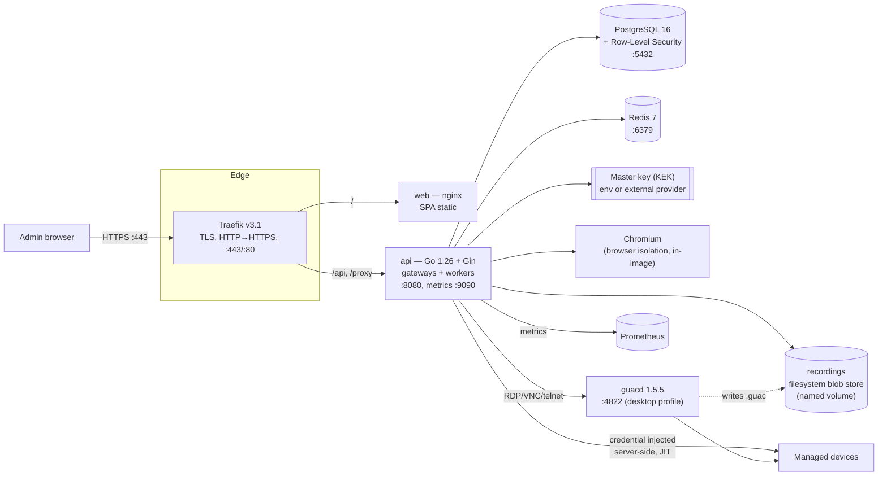

# GuardRail — System Architecture

> Repository: **https://github.com/ansh-gadhia/guardrail** ·
> Setup, ports & topology diagram: **[SETUP.md](../SETUP.md)**

> Secure Privileged Access Management (PAM) for browser-based access to network
> devices and security appliances. This document is the authoritative
> architecture reference. It is written to be implementable one milestone at a
> time without ever needing a redesign.

## 1. Product summary

GuardRail brokers administrative access to managed devices from the browser.
Administrators never see or type the target device credentials; GuardRail
authenticates the user, authorizes the request, injects device credentials
server-side inside an **isolated, recorded, audited session**, and proxies all
traffic through the platform.

Access *modalities* are **Gateway plugins** behind one
session/authorization/audit spine. Delivered today:

- **Web UIs** (`https`, `http`) — reverse proxy, or browser isolation (Chromium
  on the server) for appliance SPAs and recorded sessions.
- **Terminals** (`ssh`, `telnet`) — a server-side gateway; SSH is captured as a
  replayable text transcript.
- **Desktops** (`rdp`, `vnc`) — rendered through the Apache **guacd** sidecar and
  drawn on a canvas in the browser; sessions are recorded as Guacamole protocol
  dumps and replayed in the console.

Further modalities (Kubernetes, databases, APIs) add as new Gateway plugins with
**zero changes** to the core — the pattern the delivered gateways already follow.

## 2. Architecture style

- **Clean Architecture** — dependencies point inward. `domain` knows nothing
  about HTTP, SQL, or Redis. `app` (use cases) orchestrates domain + ports.
  `infra` implements ports (adapters). `api` is a delivery mechanism.
- **Domain-Driven Design** — bounded contexts map to modules (IAM, Assets,
  Vault, Sessions, Audit, Approvals, Notifications, Reports). Each context owns
  its aggregates and exposes an application service (use-case) interface.
- **SOLID / ports & adapters** — every external dependency (DB, cache, crypto
  provider, object store, browser engine, notifier, LDAP) is behind a Go
  interface (a *port*). Adapters live in `infra` and are wired in `main`. Any
  module is replaceable without touching the rest.
- **Twelve-Factor** — config from env, stateless processes, backing services as
  attached resources, logs to stdout, disposability with graceful shutdown.
- **API-first** — the REST API (`/api/v1`) is the contract; the SPA and any CLI
  are just clients. OpenAPI is the source of truth for the surface.
- **Secure by default / Zero Trust** — deny by default, short-lived tokens,
  per-request authorization, no implicit network trust, credentials never leave
  the vault boundary in plaintext, every privileged action is audited.

### 2.1 Layer / dependency rules

```
          ┌───────────────────────────────────────────────┐
          │  delivery (internal/api)  — Gin handlers, DTOs  │
          └───────────────▲───────────────────────────────┘
                          │ depends on
          ┌───────────────┴───────────────────────────────┐
          │  application (internal/app) — use cases,        │
          │  transaction boundaries, port interfaces        │
          └───────────────▲───────────────────────────────┘
                          │ depends on
          ┌───────────────┴───────────────────────────────┐
          │  domain (internal/domain) — entities, value     │
          │  objects, domain services, invariants. NO deps. │
          └───────────────────────────────────────────────┘
                          ▲ implemented by
          ┌───────────────┴───────────────────────────────┐
          │  infrastructure (internal/infra) — Postgres,    │
          │  Redis, crypto, object store, browser, LDAP…    │
          └───────────────────────────────────────────────┘
```

Enforced import rule (checked in CI via `go-arch-lint` / `depguard`):
`domain` imports nothing internal; `app` imports `domain` only; `infra` imports
`domain` + `app` ports; `api` imports `app`. Nothing imports `api` or `infra`
except `main`, which wires them.

## 3. Bounded contexts (modules)

| Context | Aggregates | Responsibility |
|---|---|---|
| **IAM** | User, Organization, Role, Permission, Session(auth), MFA | AuthN, AuthZ, multi-tenancy, RBAC |
| **Assets** | Device, AssetGroup, Tag | Register/organize target devices |
| **Vault** | Credential, EncryptionKey | Envelope-encrypted secret storage & injection tokens |
| **Access** | AccessSession, ApprovalRequest | Broker + authorize an access session, approval workflow |
| **Proxy** | ProxySession, BrowserInstance | Browser isolation, credential injection, traffic proxy |
| **Recording** | Recording, RecordingArtifact | Video/screenshot/event capture, retention, playback |
| **Audit** | AuditEvent | Append-only, tamper-evident audit log |
| **Notify** | NotificationChannel, Notification | Email/Slack/webhook fan-out |
| **Reports** | Report | PDF/CSV compliance & access reports |

Each context is a Go package group: `domain/<ctx>`, `app/<ctx>`,
`infra/<ctx>`, and a route file under `api/v1/<ctx>`.

## 4. Runtime topology

This is the **as-deployed** topology (Docker Compose). The default port map and a
higher-level version of this diagram live in [SETUP.md](../SETUP.md).



- **api** — the single Go service. Stateless REST (`/api/v1`), the
  credential-injecting reverse proxy (`/proxy`), and every **session gateway**
  (reverse proxy, browser isolation, SSH/telnet, and the guacd client for
  RDP/VNC) run **in-process**, selected per device by a protocol-keyed registry.
  Also hosts the background workers (notification dispatcher, session reaper,
  health poller).
- **guacd** — Apache Guacamole daemon sidecar. Renders RDP/VNC/telnet to a
  Guacamole instruction stream the browser draws, and writes the session
  recording. Behind the `desktop` Compose profile; loopback-only.
- **web** — nginx serving the React SPA.
- **Backing services** — Postgres (system of record, RLS), Redis (sessions, rate
  limits, locks, live-session registry, pub/sub for live monitoring), a
  filesystem blob store for recordings (a named volume; swappable for S3/MinIO
  behind the `BlobStore` port), and the KEK provider for the vault master key.

> **Note on evolution.** Earlier drafts of this document split the session
> gateway into a separate gRPC-connected process with an S3 recording store. The
> shipped design keeps the gateways in-process behind the `Gateway` port and uses
> a filesystem blob store behind the `BlobStore` port — both are adapters, so
> extracting the gateway into its own deployable later is a wiring change, not a
> redesign. The port boundaries the original split assumed still hold.

## 5. Key architectural decisions (ADR summary)

| # | Decision | Rationale | Trade-off |
|---|---|---|---|
| ADR-1 | Go + Gin | Fast, single static binary, mature `chromedp`, great ops story, matches container-first goal | Less compile-time safety than Rust; mitigated by strict linting |
| ADR-2 | Separate Proxy/Gateway process | Stateful & heavy; independent scaling; blast-radius isolation | Cross-process gRPC complexity |
| ADR-3 | Envelope encryption (DEK per credential, wrapped by KEK) | Rotate KEK without re-encrypting data; pluggable KMS | Key hierarchy to manage |
| ADR-4 | Postgres row-level tenant scoping + app-layer guard | Strong isolation, simple ops | Must be disciplined; enforced by repo base + RLS |
| ADR-5 | Ports & adapters for every external dep | Replaceability, testability | More interfaces/boilerplate |
| ADR-6 | Append-only hash-chained audit log | Tamper evidence for compliance | Cannot edit history (by design) |
| ADR-7 | Gateway plugin registry keyed by protocol | SSH/RDP/etc. added without core change | Plugin contract must be stable |

## 6. Multi-tenancy & isolation

- Every tenant-owned row carries `organization_id`.
- **Two layers of defense:** (1) the application always scopes queries by the
  caller's `organization_id` via a mandatory `TenantScope` passed into every
  repository call; (2) PostgreSQL **Row-Level Security** policies keyed on
  `current_setting('app.current_org')`, set per-transaction. A bug in one layer
  cannot leak cross-tenant data.
- Super Admin is the only principal that may operate cross-tenant, and only via
  explicit, audited "impersonate org" actions.

## 7. Extensibility: the Gateway plugin contract

The core issues an **AccessSession** (who, what device, granted window, audit
id). A Gateway plugin consumes it:

```go
// internal/domain/access/gateway.go
type Gateway interface {
    Protocol() Protocol            // "https","http","ssh","telnet","rdp","vnc" (k8s/db later)
    // Establish opens a brokered session; credentials are fetched via the
    // injected CredentialResolver, never passed in plaintext by the caller.
    Establish(ctx context.Context, s *AccessSession, r CredentialResolver) (LiveSession, error)
}
```

The registry is keyed by protocol; the broker picks the gateway for the device's
protocol and delivery mode. Shipped gateways: reverse proxy and browser isolation
(`infra/proxy`, `infra/browser`) for web, `infra/sshgw` for SSH/telnet terminals,
and `infra/guacgw` (the guacd client) for RDP/VNC/telnet desktops. Adding
Kubernetes or a database gateway = implement `Gateway` for that protocol and
register it in `main`; sessions, authorization, approvals, audit, recording, and
RBAC are unchanged. This is the core promise of the architecture, and the
terminal/desktop gateways are the proof it holds.

## 8. Observability

- **Structured JSON logs** to stdout (zap), one line per event, correlation IDs
  (`trace_id`, `request_id`, `session_id`) on every line.
- **OpenTelemetry** tracing across API↔Gateway↔DB; OTLP exporter, no-op by
  default (Twelve-Factor: enabled via env).
- **Prometheus** `/metrics` (RED metrics, auth outcomes, active sessions, vault
  ops, browser pool saturation).
- **Health**: `/healthz` (liveness), `/readyz` (readiness — checks DB, Redis,
  object store, migration version).

## 9. Directory layout

```
guardrail/
├── docs/                      # architecture, db, api, security, flows, roadmap
├── backend/
│   ├── cmd/guardrail/         # API entrypoint (composition root)
│   ├── cmd/gateway/           # Proxy/Gateway entrypoint (M5)
│   ├── internal/
│   │   ├── config/            # 12-factor env config + validation
│   │   ├── platform/          # cross-cutting infra: logger, http, db, redis, otel
│   │   ├── domain/<ctx>/      # entities, VOs, domain services, ports (interfaces)
│   │   ├── app/<ctx>/         # use cases / application services
│   │   ├── infra/<ctx>/       # adapters implementing ports (pg, redis, crypto…)
│   │   └── api/               # Gin router, middleware, v1 handlers, DTOs
│   ├── migrations/            # golang-migrate SQL (up/down)
│   └── test/                  # integration & e2e helpers
├── frontend/                  # React + TS + Vite SPA (M6+)
├── deploy/                    # traefik, prometheus, otel, k8s (later)
├── docker-compose.yml
├── Makefile
└── .env.example
```

See `docs/DATABASE.md`, `docs/API.md`, `docs/SECURITY.md`, `docs/FLOWS.md`,
`docs/ROADMAP.md` for the remaining design deliverables.
