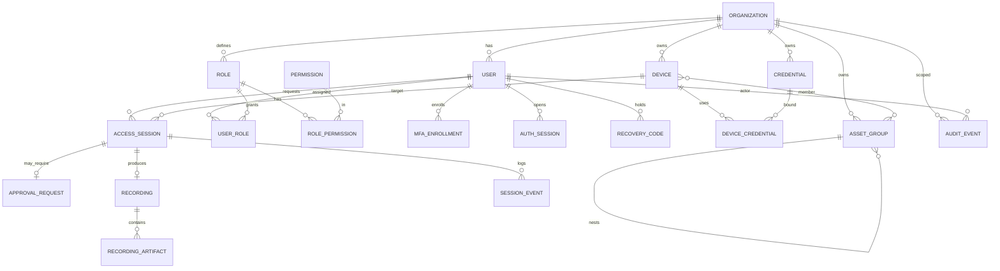

# GuardRail — Data Model

PostgreSQL 16. All tenant-owned tables carry `organization_id` and are protected
by Row-Level Security. UUIDv7 primary keys (time-ordered) via app-generated IDs.
Timestamps are `timestamptz`. Soft delete via `deleted_at` where a table is
user-managed (users, devices, groups, credentials); immutable logs are never
soft-deleted.

## ER diagram (core)

## Table catalogue

### IAM
- **organizations**(`id`, `name`, `slug` UQ, `status`, `settings jsonb`, timestamps, `deleted_at`)
- **users**(`id`, `organization_id` FK, `email` UQ-per-org, `username`,
  `password_hash` (Argon2id, nullable for federated), `status`,
  `auth_provider` (local/ldap/oidc), `external_id`, `is_super_admin`,
  `failed_login_count`, `locked_until`, `last_login_at`, timestamps, `deleted_at`)
- **roles**(`id`, `organization_id` FK-null-for-system, `name`, `is_system`, `description`)
- **permissions**(`id`, `key` UQ e.g. `device:read`, `session:terminate`, `description`) — static seed
- **role_permissions**(`role_id`, `permission_id`) PK both
- **user_roles**(`user_id`, `role_id`) PK both
- **mfa_enrollments**(`id`, `user_id` FK, `type` (totp/passkey), `secret_enc`,
  `credential_json`, `confirmed_at`, `created_at`)
- **recovery_codes**(`id`, `user_id` FK, `code_hash`, `used_at`)
- **auth_sessions**(`id`, `user_id` FK, `refresh_token_hash`, `user_agent`,
  `ip`, `expires_at`, `revoked_at`, `created_at`) — refresh-token family for rotation

### Assets
- **devices**(`id`, `organization_id` FK, `name`, `description`, `vendor`,
  `device_type`, `host`, `port`, `scheme` (http/https), `verify_tls` bool,
  `custom_headers jsonb`, `tags text[]`, `status`, timestamps, `deleted_at`)
  — UQ(`organization_id`, `host`, `port`, `scheme`) soft
- **asset_groups**(`id`, `organization_id` FK, `parent_id` FK-self-null,
  `name`, `type` (folder/dynamic), `match_rules jsonb` for dynamic, timestamps)
- **device_group_members**(`device_id`, `asset_group_id`) PK both

### Vault
- **credentials**(`id`, `organization_id` FK, `name`, `type`
  (password/api_key/certificate/client_cert), `username`,
  `secret_ciphertext bytea`, `dek_wrapped bytea`, `kek_id`, `nonce bytea`,
  `metadata jsonb`, `rotated_at`, timestamps, `deleted_at`) — plaintext never stored
- **device_credentials**(`device_id`, `credential_id`, `is_default`) PK(device,credential)
- **encryption_keys**(`id` = kek_id, `provider` (env/kms/vault), `alias`,
  `active`, `created_at`, `retired_at`) — KEK registry, no key material stored here

### Access / Approvals
- **access_sessions**(`id`, `organization_id` FK, `user_id` FK, `device_id` FK,
  `protocol`, `status` (pending/approved/active/ended/denied/expired),
  `approval_id` FK-null, `granted_from`, `granted_until`, `client_ip`,
  `user_agent`, `gateway_node`, `started_at`, `ended_at`, `end_reason`, `created_at`)
- **approval_requests**(`id`, `organization_id` FK, `access_session_id` FK,
  `requested_by` FK, `approver_id` FK-null, `status`
  (pending/approved/denied/expired), `mode` (one_time/window), `valid_minutes`,
  `reason`, `decided_at`, `expires_at`, `created_at`)

### Recording
- **recordings**(`id`, `organization_id` FK, `access_session_id` FK,
  `status`, `started_at`, `ended_at`, `duration_ms`, `retention_until`,
  `storage_bucket`, `storage_prefix`, `created_at`)
- **recording_artifacts**(`id`, `recording_id` FK, `kind`
  (video/screenshot/metadata), `object_key`, `size_bytes`, `content_type`,
  `checksum`, `created_at`)
- **session_events**(`id`, `access_session_id` FK, `ts`, `kind`
  (url_change/click/key/nav/resize), `data jsonb`) — timeline for playback

### Audit
- **audit_events**(`id`, `organization_id` FK-null-for-system, `ts`, `actor_id`,
  `actor_email`, `action`, `category`, `target_type`, `target_id`,
  `session_id`, `ip`, `user_agent`, `result` (success/failure/denied),
  `detail jsonb`, `prev_hash bytea`, `hash bytea`) — **append-only**, hash-chained
  per org: `hash = SHA256(prev_hash || canonical(row))`. No update/delete grant.

### Notify / Reports
- **notification_channels**(`id`, `organization_id` FK, `type`
  (email/slack/webhook), `config_enc bytea`, `enabled`, timestamps)
- **notifications**(`id`, `organization_id` FK, `channel_id`, `event`,
  `payload jsonb`, `status`, `attempts`, `created_at`, `sent_at`)
- **reports**(`id`, `organization_id` FK, `type`, `format` (pdf/csv), `params jsonb`,
  `status`, `object_key`, `requested_by`, `created_at`, `completed_at`)

### Ops
- **schema_migrations** — managed by golang-migrate.
- **outbox** — transactional outbox for reliable notifications/audit fan-out.

## Indexing highlights
- `users(organization_id, email)` unique partial `WHERE deleted_at IS NULL`.
- `devices(organization_id) `, GIN on `devices.tags`, GIN on `custom_headers`.
- `access_sessions(organization_id, status)`, `(user_id, created_at desc)`.
- `audit_events(organization_id, ts desc)`, `(action)`, `(actor_id, ts desc)`.
- `session_events(access_session_id, ts)`.

## Constraints & integrity
- All FKs `ON DELETE RESTRICT` except child artifacts (`CASCADE` under a parent
  recording). Tenant tables `CHECK (organization_id IS NOT NULL)` except system
  rows. Enum-like columns use Postgres `CHECK` or native enums generated from
  domain constants. RLS policies on every tenant table (see migration `0002`).

## Soft delete policy
User-managed entities set `deleted_at`; all reads filter it out at the repository
base layer. Audit, recording artifacts, and session events are **immutable** and
retained per retention policy, then hard-purged by a scheduled job.
