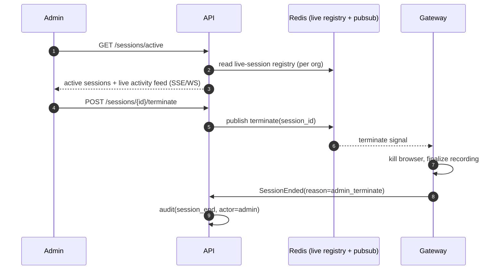
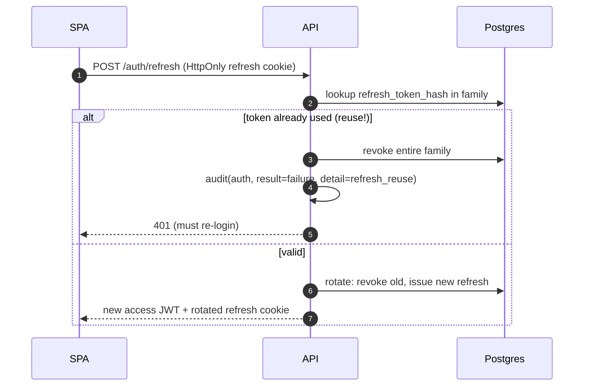

# GuardRail — Key Flows (Sequence Diagrams)

## 1. Authentication + MFA + token issuance

```mermaid
sequenceDiagram
    autonumber
    participant U as Browser (SPA)
    participant API as GuardRail API
    participant DB as Postgres
    participant R as Redis
    participant ID as LDAP/OIDC (optional)

    U->>API: POST /api/v1/auth/login {email,password}
    API->>R: check brute-force counter (ip+email)
    alt local user
        API->>DB: load user by (org,email)
        API->>API: Argon2id verify
    else federated
        API->>ID: bind / token exchange
    end
    alt bad credentials
        API->>R: incr failure; maybe lock account
        API->>DB: audit(login, result=failure)
        API-->>U: 401
    else ok, MFA required
        API->>R: store short-lived mfa_challenge (5m)
        API-->>U: 200 {mfa_required, challenge_id}
        U->>API: POST /auth/mfa {challenge_id, totp|passkey}
        API->>API: verify TOTP / WebAuthn assertion
    end
    API->>DB: create auth_session (refresh family)
    API->>R: cache session + permissions snapshot
    API->>DB: audit(login, result=success)
    API-->>U: 200 access JWT (15m) + refresh cookie (HttpOnly, Secure, SameSite=Strict)
```

Access token: short-lived JWT (15m) with `sub`, `org`, `roles`, `perm_ver`.
Refresh: opaque, rotated on every use, family-revoked on reuse detection.

## 2. Secure "Connect" — brokered, recorded browser session

This is the core flow. The user never receives device credentials.

```mermaid
sequenceDiagram
    autonumber
    participant U as Admin browser
    participant API as GuardRail API
    participant AZ as AuthZ + Approval
    participant V as Vault
    participant GW as Proxy/Gateway
    participant BR as Isolated Chromium
    participant D as Target device
    participant OS as Object store

    U->>API: POST /api/v1/devices/{id}/connect
    API->>AZ: check permission device:connect + tenant scope
    alt approval required
        AZ->>API: create approval_request (pending)
        API-->>U: 202 {status: pending_approval}
        Note over API: (see flow 3; resumes on approval)
    end
    API->>API: create access_session(status=approved, granted_until)
    API->>GW: gRPC Establish(session_token) [no credentials in call]
    GW->>BR: launch per-session container (fresh profile, isolated cookies)
    GW->>API: gRPC ResolveCredential(session_token)  // short-lived, one-shot
    API->>AZ: re-verify session still valid + window open
    API->>V: decrypt DEK via KEK, decrypt secret
    API-->>GW: credential material (in-memory, TTL, single use)
    GW->>BR: navigate to device URL; inject credentials via automation\n(form fill / header / client cert) — not exposed to end user
    BR->>D: HTTPS (verify_tls per device); establish device auth
    GW->>OS: start recording (video/screenshot/event stream)
    API->>API: audit(session_start, credential_use)
    GW-->>API: session active {gateway_node}
    API-->>U: 200 {proxy_url}  // streamed UI, not raw device
    U->>GW: interact via streamed/proxied browser
    GW->>OS: append recording + session_events
    Note over U,GW: idle-timeout / max-window / admin-terminate all end session
    GW->>API: SessionEnded(reason)
    API->>API: audit(session_end); finalize recording + retention
```

Credential handling guarantees:
- Credentials are resolved **just-in-time**, one-shot, in-memory in the Gateway
  only, never sent to the user's browser, never written to disk or logs.
- Injection happens inside the isolated automated Chromium (form fill, custom
  header, or client cert). Browser storage on the user side holds only a
  GuardRail session handle, never device secrets.
- The per-session Chromium profile is destroyed on end (cookie/cache isolation).

## 3. Approval workflow

```mermaid
sequenceDiagram
    autonumber
    participant U as Requester
    participant API as API
    participant N as Notifier
    participant M as Approver

    U->>API: connect -> approval_request(pending, mode, valid_minutes)
    API->>N: notify approvers (email/slack/webhook)
    M->>API: POST /approvals/{id}/approve  (perm: approvals:decide)
    API->>API: set approved; access_session granted_until = now+window\n(or one_time)
    API->>N: notify requester
    U->>API: resume connect (flow 2)
    Note over API: unapproved by expires_at -> status=expired, denied path audited
```

## 4. Live session monitoring & forced termination



## 5. Token refresh with reuse detection


